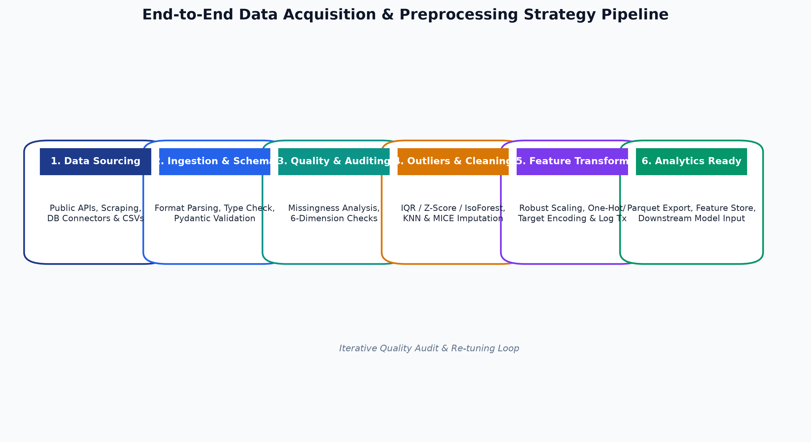
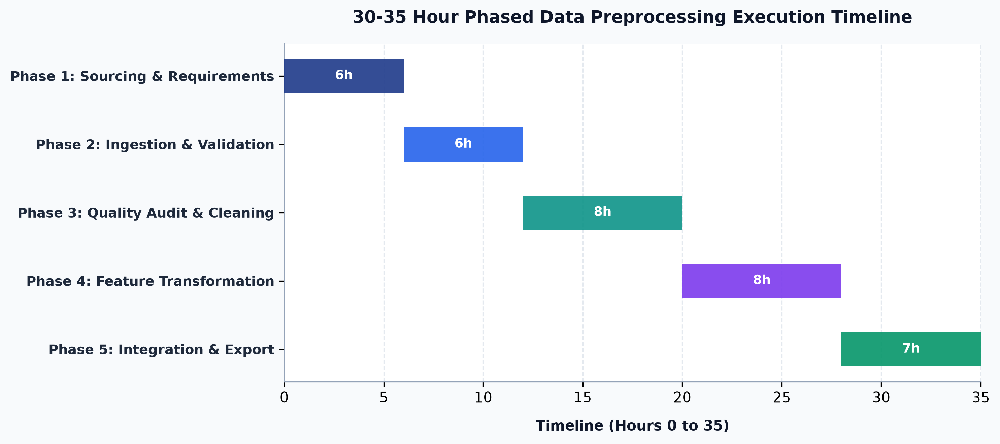

# Enterprise Data Acquisition & Preprocessing Strategy

> A Technical Roadmap for Data Sourcing, Quality Auditing, Outlier Detection, Imputation, and Feature Transformation in Python Data Analytics

---

## 📌 Executive Summary

In modern data analytics and data science, raw real-world data is inherently noisy, incomplete, unstructured, and prone to distribution anomalies. Direct consumption of raw data leads to distorted statistical inferences, unstable machine learning models, and untrustworthy business intelligence KPIs ("*Garbage In, Garbage Out*").

This repository provides a comprehensive **Data Acquisition and Preprocessing Strategy** designed for enterprise-grade Python analytics projects. It covers:
1. Strategic sourcing of public data via REST APIs, web scraping, and database connectors.
2. A 6-dimension data quality and validation framework.
3. Advanced outlier detection (Z-Score, IQR, Isolation Forest) and missing value treatment (MICE, KNN, Indicator flags).
4. Rigorous methodology for Python tool selection (`Pandas`, `NumPy`, `Scikit-Learn`, `SciPy`).
5. Modular production-ready Python preprocessing pseudo-code.
6. Downstream analytics mapping linking each preprocessing action to analytical outcomes.
7. A 30–35 hour phased execution timeline with deliverables.
8. An automated Python generator script (`generate_docs.py`) to create a styled Microsoft Word deliverable (`Data_Acquisition_and_Preprocessing_Strategy.docx`).

---

## 📋 Deliverable Files

| Deliverable File | Description | Format |
| :--- | :--- | :--- |
| **`Data_Acquisition_and_Preprocessing_Strategy.docx`** | Primary Executive Document complete with styled headers, custom tables, callout boxes, code listings, embedded visual workflow diagrams, and Gantt charts. | `.docx` Word Document |
| **`README.md`** | Comprehensive project overview, methodology documentation, architecture diagrams, pseudo-code listings, and execution guide. | Markdown |
| **`generate_docs.py`** | Automated Python script leveraging `python-docx` and `matplotlib` to programmatically build the `.docx` document and visual charts. | Python Script |
| **`workflow_flowchart.png`** | High-resolution 300 DPI architecture diagram illustrating the end-to-end preprocessing pipeline. | Image PNG |
| **`timeline_gantt.png`** | High-resolution 300 DPI Gantt chart detailing the 30–35 hour execution phases. | Image PNG |

---

## 🌐 1. Public Data Sources & Selection Criteria

Selecting appropriate data sources requires balancing domain relevance, legal compliance, schema stability, and technical feasibility. Public datasets are systematically evaluated using a 7-point selection framework.

### 📊 Data Selection Criteria Framework

```
                       ┌────────────────────────────────────────┐
                       │    7-POINT SELECTION FRAMEWORK         │
                       └──────────────────┬─────────────────────┘
                                          │
    ┌──────────────────┬──────────────────┼──────────────────┬──────────────────┐
    ▼                  ▼                  ▼                  ▼                  ▼
Freshness &        Licensing &        Schema          Missingness        Granularity &
Cadence            Governance        Stability        Threshold          Coverage
(Daily/API)        (CC-BY 4.0)       (SemVer)         (< 15% Nulls)      (Event-level)
```

| Evaluation Criterion | Threshold / Metric | Strategic Rationale & Target Objective |
| :--- | :--- | :--- |
| **1. Freshness & Cadence** | Daily / Real-time API | Guarantees models capture current macro trends without temporal lag. |
| **2. Licensing & Governance** | CC-BY 4.0 / Open Data | Mitigates legal liabilities; permits commercial and research reuse. |
| **3. Schema Stability** | Semantic Versioned API | Minimizes unexpected breaking structural changes during automated pipeline runs. |
| **4. Missingness Ratio** | Unrecoverable Nulls < 15% | Limits bias introduced by aggressive row/column truncation. |
| **5. Spatial/Temporal Coverage** | 5+ Years Longitudinal Data | Ensures statistical power and seasonal trend analysis capabilities. |
| **6. Granularity** | Transaction / Event Level | Provides maximum flexibility for multi-level aggregations (daily, weekly, regional). |
| **7. API Throttling Limits** | >= 1,000 requests/min | Enables high-throughput batch extraction within project constraints. |

### 🎯 Primary Benchmark Sources
- **World Bank Data API**: Global macroeconomic indicators, development metrics, and inflation indices.
- **NYC OpenData Portal**: Granular urban mobility, municipal service logs, and public infrastructure metrics.
- **Kaggle Financial & E-Commerce Telemetry**: High-density transaction logs, consumer behavior metrics, and basket pricing.

---

## ⚙️ 2. Data Extraction Methods & Challenge Mitigation

Data extraction connects external data repositories to local analytical compute environments. Technical safeguards ensure extraction resilience.

| Extraction Vector | Anticipated Technical Challenge | Countermeasure & Mitigation Strategy |
| :--- | :--- | :--- |
| **RESTful APIs** | HTTP 429 Rate Limiting & Throttling | Exponential backoff retry policy (`tenacity` library) with persistent API key rotation. |
| **Web Scraping** | Anti-Bot Captchas & Dynamic JS Rendering | Headless Playwright rendering with user-agent randomization and polite delay intervals (1–3s). |
| **Bulk File Ingestion** | Memory Overflow on Large CSVs | Chunked streaming (`pandas.read_csv(chunksize=50000)`) and PyArrow Parquet memory mapping. |
| **Heterogeneous Sources** | Encoding Mismatch (Latin-1 / UTF-8) | Automatic `chardet` encoding detection and forced UTF-8 byte stream coercion upon download. |
| **Network Volatility** | Connection Timeouts & Partial Packets | Atomic partial downloads stored in staging buckets with SHA-256 integrity verification. |

---

## 🔍 3. Data Quality Assurance, Validation & Cleaning Strategy

### 📏 The 6 Dimensions of Data Quality
1. **Completeness**: Measure of missing values across features and records.
2. **Accuracy**: Conformity of data values to authoritative ground-truth standards.
3. **Consistency**: Absence of conflicting information across correlated tables or attributes.
4. **Timeliness**: Temporal currency and latency between event occurrence and ingestion.
5. **Validity**: Adherence to defined domain rules, regex patterns, and range boundaries.
6. **Uniqueness**: Freedom from duplicate records or redundant entity representations.

---

### 🧩 Missing Data Taxonomy & Imputation Strategy

Handling missing values requires diagnosing the underlying statistical mechanism:

```
                            ┌────────────────────────┐
                            │ MISSING DATA DIAGNOSIS │
                            └───────────┬────────────┘
                                        │
         ┌──────────────────────────────┼──────────────────────────────┐
         ▼                              ▼                              ▼
     [ MCAR ]                        [ MAR ]                        [ MNAR ]
Missing Completely               Missing at Random               Missing Not at Random
   at Random                 (Correlated with Observed)      (Correlated with Unobserved)
         │                              │                              │
         ▼                              ▼                              ▼
Mean / Median Impute            KNN / MICE Imputation           Missingness Indicator Flag
  (or Drop if < 3%)               (IterativeImputer)           (is_missing=1) + Domain Logic
```

1. **MCAR (Missing Completely at Random)**:
   - *Diagnostic*: Missingness probability is uniform and independent of observed or unobserved data.
   - *Action*: Mean/Median imputation for numeric features; Mode for categorical. Listwise deletion if missingness < 3%.
2. **MAR (Missing at Random)**:
   - *Diagnostic*: Missingness probability depends systematically on observed features (e.g., income missingness correlated with age group).
   - *Action*: K-Nearest Neighbors (KNN) Imputation or Multivariate Imputation by Chained Equations (MICE via `IterativeImputer`).
3. **MNAR (Missing Not at Random)**:
   - *Diagnostic*: Missingness depends on the unobserved true values themselves (e.g., high-income earners withholding salary details).
   - *Action*: Create binary missingness indicators (`is_missing=1`) to preserve informative missingness, coupled with domain-specific modeling.

---

### 📉 Outlier Detection & Treatment Methodologies

Outliers can represent measurement errors or genuine extreme occurrences. Three complementary algorithms are implemented:

#### 1. Z-Score (Parametric)
- **Assumption**: Underlying data follows a Gaussian (normal) distribution.
- **Formula**:
  $$Z = \frac{X - \mu}{\sigma}$$
- **Threshold**: Records with $|Z| > 3.0$ are flagged as univariate outliers.

#### 2. Interquartile Range (IQR - Non-Parametric)
- **Assumption**: Distribution-agnostic; resilient to pre-existing heavy skewness.
- **Formula**:
  $$\text{IQR} = Q_3 - Q_1$$
  $$\text{Lower Bound} = Q_1 - 1.5 \times \text{IQR}, \quad \text{Upper Bound} = Q_3 + 1.5 \times \text{IQR}$$

#### 3. Isolation Forest (Multivariate Machine Learning)
- **Mechanism**: Randomly partitions feature space via decision trees. Anomalies isolate closer to tree roots due to few splitting conditions required.
- **Application**: Detects complex high-dimensional outliers where individual feature values appear normal in isolation.

#### 🛠️ Outlier Treatment Action
Rather than naive deletion (which reduces sample size and statistical power), extreme values undergo **Winsorization** (capping extreme values at the 1st and 99th percentiles) or **Log Transformation** ($\ln(1+x)$) to constrain leverage while preserving data points.

---

## 🛠️ 4. Python Toolchain Rationale & Transformation Methodology

### 🧰 Python Library Justification Matrix

| Library / Framework | Core Preprocessing Responsibilities | Technical Rationale & Advantages |
| :--- | :--- | :--- |
| **`Pandas` 2.x** | DataFrame manipulation, time-series indexing, aggregation | Native Apache Arrow integration, low-overhead index alignment, versatile I/O connectors. |
| **`NumPy` 1.26+** | Vectorized array math, matrix transformations, log transforms | C-optimized BLAS/LAPACK hardware acceleration, minimal memory footprint. |
| **`Scikit-Learn` 1.4+** | Scalers, Encoders, Imputers, Pipeline orchestration | Production-grade API, prevents data leakage via explicit `fit()` / `transform()` isolation. |
| **`SciPy` 1.12+** | Normality tests (Shapiro-Wilk), Box-Cox transforms, Z-scores | Comprehensive statistical distribution modeling and hypothesis testing functions. |
| **`Polars` / `Dask`** | Out-of-core streaming, parallel multi-threaded file reads | Serves as scalable fallback for datasets exceeding physical memory limits (> 10GB). |

---

### 🔄 Feature Transformation Strategy

- **Scaling Strategy**: 
  - **`RobustScaler`**: Utilized for features with remaining extreme values (scales by Median and IQR).
  - **`StandardScaler`**: Applied to Gaussian-distributed numeric features for Z-score normalization.
- **Categorical Encoding**:
  - **One-Hot Encoding (`OneHotEncoder`)**: For low-cardinality nominal categories (< 10 levels) with `handle_unknown='ignore'`.
  - **Target / Frequency Encoding**: For high-cardinality nominal categories to prevent dimensionality explosion.
- **Skewness Correction**: Features displaying skewness $|S| > 1.0$ undergo $\log(1+x)$ or Box-Cox transformation to normalize residuals.

---

## 🏗️ 5. Preprocessing Workflow & Modular Pseudo-code

### 📐 Visual Pipeline Architecture



---

### 💻 Modular Production Python Pseudo-code

Below is the production-grade modular Python pipeline structure:

```python
import pandas as pd
import numpy as np
from sklearn.base import BaseEstimator, TransformerMixin
from sklearn.preprocessing import RobustScaler, OneHotEncoder
from sklearn.impute import KNNImputer
from sklearn.ensemble import IsolationForest

class ProductionDataPipeline(BaseEstimator, TransformerMixin):
    """
    Modular Production Preprocessing Pipeline enforcing Data Validation,
    Missing Value Imputation, Outlier Detection, and Feature Transformation.
    """
    def __init__(self, numeric_cols, categorical_cols, outlier_contamination=0.03):
        self.numeric_cols = numeric_cols
        self.categorical_cols = categorical_cols
        self.contamination = outlier_contamination
        
        self.imputer = KNNImputer(n_neighbors=5)
        self.scaler = RobustScaler()
        self.encoder = OneHotEncoder(sparse_output=False, handle_unknown='ignore')
        self.iso_forest = IsolationForest(contamination=self.contamination, random_state=42)
        
    def fit(self, X, y=None):
        # 1. Fit Missingness Imputer on Numerics
        self.imputer.fit(X[self.numeric_cols])
        imputed_num = self.imputer.transform(X[self.numeric_cols])
        
        # 2. Fit Robust Scaler
        self.scaler.fit(imputed_num)
        
        # 3. Fit Categorical Encoder
        self.encoder.fit(X[self.categorical_cols].fillna("MISSING"))
        
        # 4. Fit Anomaly Detector
        self.iso_forest.fit(imputed_num)
        return self

    def transform(self, X):
        X_clean = X.copy()
        
        # 1. Impute Numerics
        imputed_num = self.imputer.transform(X_clean[self.numeric_cols])
        
        # 2. Flag Outliers via Isolation Forest
        outlier_flags = self.iso_forest.predict(imputed_num)
        X_clean['is_outlier'] = np.where(outlier_flags == -1, 1, 0)
        
        # 3. Scale Numeric Features
        scaled_num = self.scaler.transform(imputed_num)
        df_scaled = pd.DataFrame(
            scaled_num, 
            columns=[f"{c}_scaled" for c in self.numeric_cols], 
            index=X_clean.index
        )
        
        # 4. Encode Categorical Features
        encoded_cat = self.encoder.transform(X_clean[self.categorical_cols].fillna("MISSING"))
        cat_feature_names = self.encoder.get_feature_names_out(self.categorical_cols)
        df_encoded = pd.DataFrame(encoded_cat, columns=cat_feature_names, index=X_clean.index)
        
        # 5. Assemble Analytics-Ready Matrix
        final_df = pd.concat([df_scaled, df_encoded, X_clean[['is_outlier']]], axis=1)
        return final_df
```

---

## 🎯 6. Linkage to Downstream Analytics Outcomes

Each step in the preprocessing pipeline directly optimizes mathematical mechanics in downstream analytical models:

| Preprocessing Action | Target Analytics Technique | Direct Analytical Outcome & Mathematical Impact |
| :--- | :--- | :--- |
| **IQR Winsorization** | Multiple Linear Regression | Prevents high-leverage extreme points from skewing OLS estimates and inflating Standard Errors. |
| **Robust Scaling** | K-Means / KNN Clustering | Prevents features with large raw scales from dominating Euclidean distance calculations. |
| **MICE / KNN Imputation** | Random Forest / Gradient Boosting | Preserves feature covariance structures necessary for accurate Gini impurity variance reduction. |
| **Log Transformation** | ANOVA / Hypothesis Testing | Normalizes right-skewed residuals to satisfy homoscedasticity and Gaussian assumptions. |
| **Deduplication & Alignment** | Time Series (ARIMA / Prophet) | Eliminates artificial revenue spikes and guarantees uniform temporal spacing. |

---

## 🗓️ 7. Phased Execution Timeline (30–35 Hours)

### 📈 Visual Gantt Timeline Chart



---

### ⏱️ Phase-by-Phase Deliverables Breakdown

| Project Phase | Hours Allocated | Core Engineering Activities | Key Phase Deliverable |
| :--- | :---: | :--- | :--- |
| **Phase 1: Sourcing & Requirements** | **6 Hours** | Set up API keys, evaluate open data criteria, write raw extraction scripts. | Data Selection Matrix & Raw Scripts |
| **Phase 2: Ingestion & Validation** | **6 Hours** | Implement schema contracts (Pydantic), validate types, check encoding. | Verified Schema Staging Tables |
| **Phase 3: Quality Audit & Cleaning** | **8 Hours** | Execute missingness diagnostics, run KNN/MICE, apply IQR/Isolation Forest. | Cleaned Data & Quality Audit Log |
| **Phase 4: Feature Transformation** | **8 Hours** | Apply Robust Scaling, One-Hot/Target Encoding, log transforms. | Analytics-Ready Feature Store |
| **Phase 5: Integration & Docs** | **7 Hours** | Modularize Python pipeline, run automated unit tests, generate `.docx`. | Final `.docx` Deliverable & Codebase |

---

## 🚀 How to Run & Regenerate the Word Document

To regenerate the styled Word document (`Data_Acquisition_and_Preprocessing_Strategy.docx`) and update the visual charts:

```bash
# 1. Ensure Python dependencies are installed
pip install python-docx matplotlib pandas numpy scikit-learn

# 2. Execute the document builder script
python generate_docs.py
```

Upon completion, `generate_docs.py` will regenerate:
- `workflow_flowchart.png` (High-res 300 DPI Preprocessing Pipeline Diagram)
- `timeline_gantt.png` (High-res 300 DPI Execution Gantt Chart)
- `Data_Acquisition_and_Preprocessing_Strategy.docx` (Complete Word Document Deliverable)

---
*Created as part of the Data Analytics Strategic Framework for Data Acquisition and Preprocessing.*
